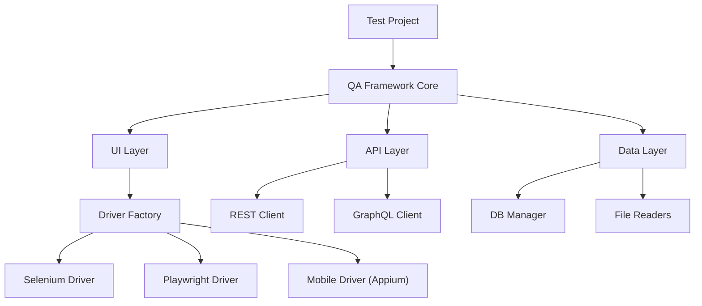
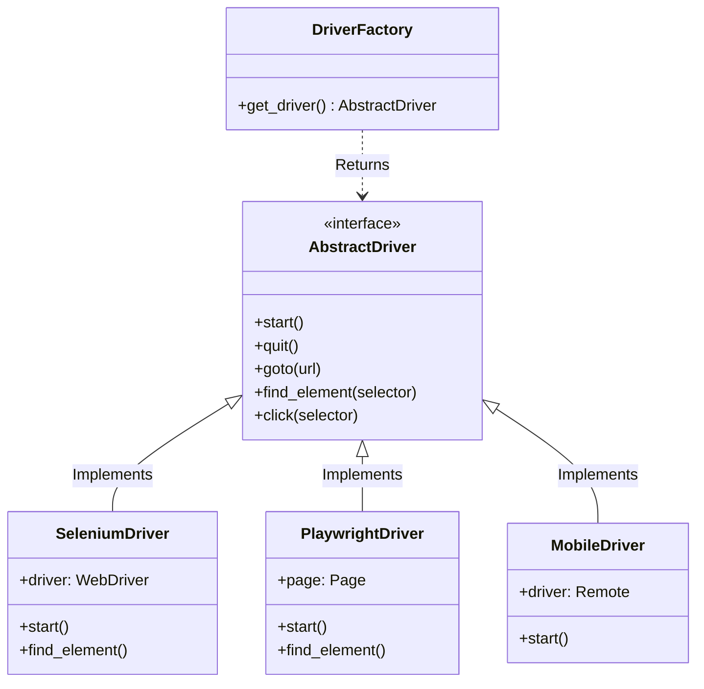
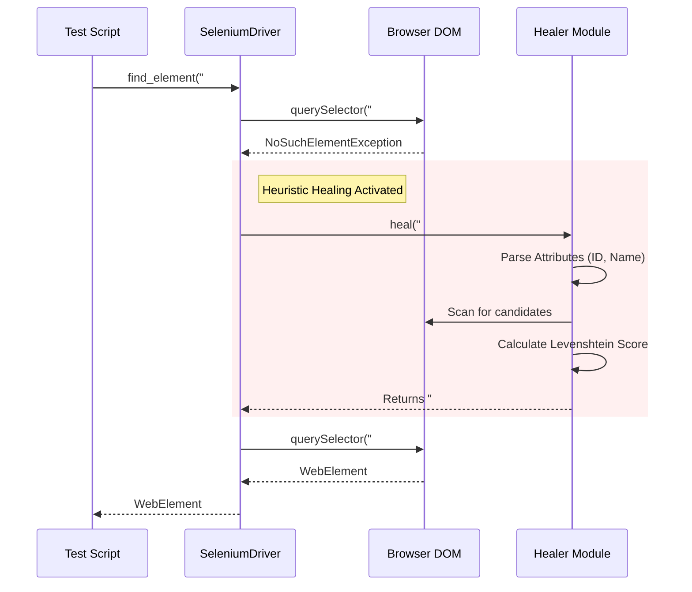
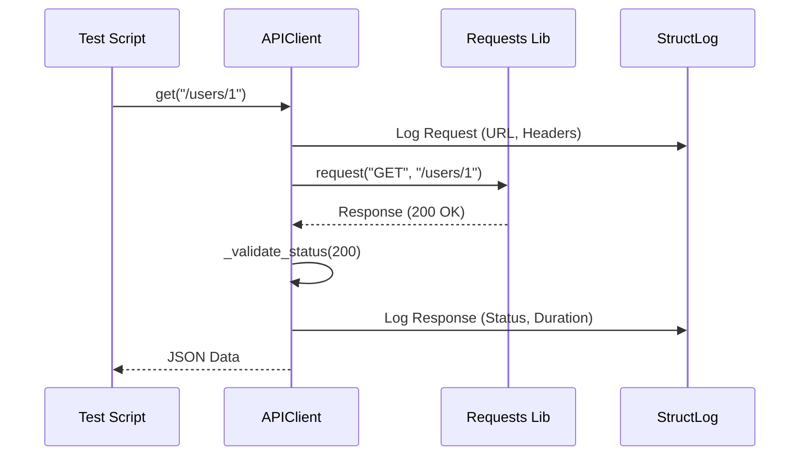

# Architecture

The framework follows a **Core Library** architecture, intended to be installed as a dependency in your test projects.

## High-Level Design

## Design Principles

1.  **Abstraction**: Test code interacts with `AbstractDriver` and `BasePage`, not directly with Selenium/Playwright.
2.  **Configuration**: All settings are managed via `pydantic-settings` and `.env` files.
3.  **Logging**: Structured logging using `structlog` ensures traceability.

## Low-Level Design (LLD)

### 1. Driver Factory Class Diagram

This diagram validates the **Factory Pattern** and **Strategy Pattern** used to switch between Selenium, Playwright, and Appium.

### 2. Self-Healing Sequence Diagram

How the `Healer` intervenes when an element is missing.

### 3. API Client Flow

How the wrapper handles logging and error checks.

## Component Breakdown

### 1. Core Library (`qa_framework`)

The standard distribution package installed via pip. It acts as the backbone, providing shared utilities, configuration management, and base classes.

### 2. UI Automation Layer

- **Driver Factory**: A centralized point that reads the configuration and instantiates the correct driver.
- **Abstract Driver**: A Python Protocol/Interface that defines standard actions to ensure test code remains agnostic.
- **Page Object Model (POM)**: The `BasePage` class encapsulates common page interactions.

### 3. API Automation Layer

- **API Client**: Wrapper around `requests` handling session management, logging, and error verification.
- **GraphQL Client**: Extends API Client for query/mutation structures.

### 4. Data Layer

- **DB Manager**: SQLAlchemy-based manager dealing with connections and session scoping.
- **File Readers**: Utilities to parse JSON, YAML, CSV, and XLSX files.

## Execution Flow

The following describes the lifecycle of a typical test run:

1.  **Initialization Phase**
    - The test runner (Pytest) starts.
    - `conftest.py` loads the **Settings** from `.env`.
    - **Logger** is configured.
2.  **Setup Phase**
    - **Driver Factory** initializes the browser.
    - **DB Manager** creates a connection pool.
    - Test Data is loaded using **File Readers**.
3.  **Execution Phase**
    - Test Function calls a **Page Object**.
    - The **Page Object** delegates to the **Abstract Driver**.
    - The **Driver** executes on the browser.
4.  **Reporting Phase**
    - All actions are logged via `structlog`.
    - `AllureListener` attaches screenshots on failure.
5.  **Teardown Phase**
    - Browser session is closed.
    - Temporary files are cleaned up.
